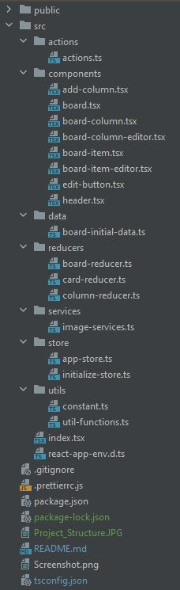

# react-dnd-task - Duke Ho
This repo contains the source code for a drag-and-drop task board.

## Assessment Tasks:
### 1. Extend the project so that new tasks can be added
### 2. Extend the project so that tasks can be edited and saved
### 3. Extend the project so that columns can be dragged into a different order.

## Dependencies

In this project I use:
- [redux](https://redux.js.org): to manage the global state of the app
- [react-textarea-autosize](https://github.com/andreypopp/react-textarea-autosize): a react component that will render a textarea that resizes itself when needed
- [react-beautiful-dnd](https://github.com/atlassian/react-beautiful-dnd): A beautiful library to implement drag and drop functionalities
- [lodash.throttle](https://www.npmjs.com/package/lodash.throttle): to prevent too many calls of a function
- [shortid](https://github.com/dylang/shortid): to generate unique ids. 
- [axios](https://www.npmjs.com/package/axios): Promise based HTTP client for the browser and node.js
- [fontawesome](https://fontawesome.com/v5.15/how-to-use/on-the-web/using-with/react): FontAwesome icons for icons in the project
- [prettier](https://www.npmjs.com/package/prettier): to format code style

## Project Structure
Now your project structure should be:




## Start

Go to file [utils/constant.ts](src/utils/constant.ts) and add your REACT_APP_CLIENT_KEY from [Unsplash](https://unsplash.com/developers)

Start the app with the following command:

```bash
npm start
```
Every time you change your code the app wil be reloaded automatically.


## Build

Go to file [utils/constant.ts](src/utils/constant.ts) and add your REACT_APP_CLIENT_KEY from [Unsplash](https://unsplash.com/developers)

Build the app with the following command:

```bash
npm build
```
It will build an optimized production version.
